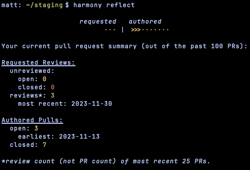
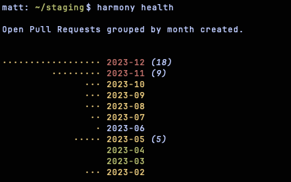

# Harmony
Harmony is a small tool that helps teams keep GitHub reviews running smoothly. It takes the work out of picking someone from a pool of developers to review a new PR. Harmony does this by heuristically determining who on a particular GitHub Team has the least current/recent review workload.

Harmony offers a heuristic for PR review requests that is different than GitHub's round robin or weighted algorithms, but Harmony can also work well even if your team uses GitHub's automatic PR review requests ([see below](#deferring-to-github)).

## Dependencies
### Runtime
Running Harmony requires NodeJS 18+ (and a local installation of `git`) or alternatively Nix with flakes enabled.

If you'd like to try Harmony out without even "installing" it and you have Nix installed with flakes enabled, you can run it as `nix run github:mattpolzin/harmony`.

### Build time
Building the latest commits of Harmony requires a HEAD build of the Idris 2 compiler. Each release page also indicates the version of Idris 2 that particular release will build against.

Alternatively, you can build Harmony with Docker (see [Docker Build](#docker-build)).

## Installation
For any installation, you need to have a GitHub [Personal Access Token](https://docs.github.com/en/github/authenticating-to-github/keeping-your-account-and-data-secure/creating-a-personal-access-token).

Your Personal Access Token should have the following permissions:
- `repo` (Full control of private repositories)
- `read:org` (Read org and team membership, read org projects)
- `read:user`
- `user:email`
- `read:discussion`
- `read:enterprise` (Read enterprise profile data)

You can either add the PAT to your environment as the `GITHUB_PAT` variable (perhaps exporting it from your shell resource file or profile) or you can store your PAT in Harmony's config file. The first time you start Harmony, it will ask you to configure your PAT if you don't want to use the Environment variable. You only need one of (a) the ENV var and (b) the config property and the environment variable will take precedence if you have both set.

### NPM
You can install Harmony via npm directly by running `npm install -g @mattpolzin/harmony`.

### GitHub Release
You can install any Harmony release by downloading the `harmony-npm.tar.gz` file from the GitHub Release page, unzipping it, and running `npm install --global`.

### Nix Flake
You can add Harmony to your Flake inputs as follows:
```nix
  inputs = {
    ...
    harmony.url = "github:mattpolzin/harmony";
    harmony.inputs.nixpkgs.follows = "nixpkgs";
  };
```

Then, in your outputs, bring Harmony into a package install list as `harmony.packages.<system>.harmony`.

### From Source
The build script assumes a HEAD build of Idris 2 is installed on your system. For an alternative, see the [Docker Build](#docker-build) instructions below.

Build Harmony from source with a call to `make`. Then install it globally with `make install`.

#### Docker Build
If you want to build Harmony without installing Idris 2 on your system, you can build Harmony within a Docker container and then install the resulting Javascript onto your system.

First, download the latest nightly Docker image:
```shell
docker pull mattpolzin2/idris-docker:nightly
```

Then, from a directory containing this Harmony git repository, build Harmony:
```shell
docker run --rm -v "$(pwd):/build" mattpolzin2/idris-docker:nightly bash -c "apt-get update && apt-get install -y git && cd /build && make"
```

At this point you are done with Docker. From the same directory, install Harmony globally:
```shell
npm install --global
```

### Bash completion
Set up Bash completion by adding the following to your Bash resource file or profile:
```shell
eval "$(harmony --bash-completion-script)"
```

### Zsh completion
Zsh completion is supported via `bashcompinit` and can be loaded by adding the following to your Zsh resource file or profile:
```shell
eval "$(harmony --zsh-completion-script)"
```

## Usage
The first time you start Harmony in any particular folder, you will be asked to provide some information about the GitHub repository you are working with. This information is stored in a file named `harmony.json` in the current working directory.

Note that the GitHub organization and repository are both slugs, not names. These are the values you find in a GitHub URL pointing to your repository. Harmony does not work with personal repositories because they do not have teams or members.
```
$ harmony sync
Creating a new configuration (storing in harmony.json)...

Harmony uses a GitHub Personal Access Token (PAT) to communicate with GitHub.
You can set this via the $GITHUB_PAT environment variable or a config property.
If you don't set in your config now, you can set later with `harmony config githubPAT abcdefg`.
The ENV var will always take precedence over the config property.

What PAT would you like to set in the config file (ENTER for default: unset)?

What GitHub org would you like to use harmony for (ENTER for default: myorg)?

What repository would you like to use harmony for (ENTER for default: myrepo)?

What GitHub remote repo would you like to use harmony for (ENTER for default: origin)?

Would you like harmony to comment when it requests reviewers? [Y/n] 
Would you like harmony to request team reviews in addition to individuals when it requests reviewers? [Y/n] 
Creating config...
```

Once configured, Harmony supports the following commands: `config`, `branch`, `pr`, `label`, `request` (also aliased to `rq`), `contribute`, `whoami`, `reflect`, `list`, `graph`, `health`, and `sync`.

**Note on color output:**
Harmony uses colored output for some commands. You can adjust these colors slightly with the `theme` configuration option. You can also use the `NO_COLOR` environment variable to disable all colored output. Lastly, Harmony will avoid colored output when it determines `stdout` is not a TTY device (as is the case for e.g. redirecting harmony output into a file or piping into `cat`: `harmony ... | cat`).

### Config
Running `harmony config <property>` will read the given configuration property. `harmony config <property> <value>` will set the configuration property.

Not all configuration properties can be read/set with this command.
#### Properties
- `requestTeams` (`true`/`false`) -- When picking a reviewer from a team, request the team as a reviewer as well.
- `requestUsers` (`true`/`false`) -- When requesting a team as a reviewer, pick a user to review as well.
- `commentOnRequest` (`true`/`false`) -- When requesting a reviewer chosen by Harmony, comment on the pull request.
- `defaultRemote` (optional string) -- When pushing new branches, what remote destination should be used.
- `mainBranch` (optional string) -- When creating a PR, this is the default base branch.
- `theme` (`dark`/`light`) -- Use colors suited better for either a dark or light Terminal background.
- `githubPAT` (optional string) -- If the `$GITHUB_PAT` environment variable is not set, this Personal Access Token is used to authenticate with GitHub.

### Branch
Running `harmony branch` will print the URI for accessing the currently checked out branch on GitHub.

Many operating systems have an `open` command (though the name "open" is not ubiquitous); this means you can run something like `open $(harmony branch)` to open a web browser to the current branch on GitHub.

### PR
Running `harmony pr [--draft] [#<label>, ...]` with a branch checked out will reach out to GitHub to determine if there is an open PR for that branch. If there is a PR, Harmony will print a URI that can be used to view the PR. If there is not a PR, Harmony will help you create one. New PRs can be created as drafts by specifying the `--draft` flag with the `pr` command.

If you need to create a PR still, you will be prompted for a branch to open the PR against (merge into, eventually), a title for the PR, and a description for the PR. If you have an `EDITOR` environment variable set, Harmony will use that editor to get the PR description from you. If you have a PR template at `.github/PULL_REQUEST_TEMPLATE.md`, Harmony will also preload that into your editor. If you do not have an `EDITOR` environment variable set, you will still be able to enter a description from the command line but PR templates are only supported when an `EDITOR` is specified.

You can also specify any number of labels to apply by prefixing them with '#'. For example, `harmony pr #backport #bugfix` would create a PR and apply the `backport` and `bugfix` labels.

Many operating systems have an `open` command (though the name "open" is not ubiquitous); this means you can run something like `open $(harmony pr)` to open a web browser to an existing PR for the current branch.

### Label
Running `harmony label {<label>} [...]` will help you create a PR if one does not exist yet and then it will apply the given labels to the PR. This is essentially an alias for the `harmony pr` command but without support for creating draft PRs.

Note that labels are _not_ prefixed with '#' for this command. There is no need to differentiate labels from other kinds of arguments to `harmony label`.

### Request
Running `harmony request {<team> | +<user>} [#<label>] [...]` will help you create a PR if one does not exist yet and then it will request reviews from teams and/or users.

There is also a `harmony rq` alias for `harmony request`.

If `harmony config requestUsers` is `True` (defualt) then harmony will pick someone to review the PR (from one of the listed teams). If `harmony config requestTeams` is `True` (default) then harmony will request reviews from the teams you listed. If `harmony config commentOnRequest` is `True` then harmony will comment on the Pull Request indicating that teams & users were "harmoniously requested" -- this comment will @mention requested users so it may be useful or annoying depending on the requested user's GitHub notification settings.

You can also require that specific additional users (on top of the one Harmony will pick for you) are requested to review the PR. You do this by specifying those users' logins prefixed with '+' as arguments to Harmony. This will request review from those specific additional users regardless of the `requestUsers` setting; that setting controls whether Harmony picks users from each Team you specify to review PRs.

You can optionally apply any number of labels to the PR at the same time as requesting reviewers by prefixing the labels with '#'.

#### Deferring to GitHub
If your team has GitHub set up to auto-request reviews from individuals when a team is requested for review, you probably want to tell harmony not to also pick someone using its heuristics. You can run the following `config` commands to tell harmony to request a team but not also pick an individual from that team:
```shell
harmony config requestTeams true
harmony config requestUsers false
```
This does not prevent you from requesting specific individuals with the `+<user>` syntax described above.

#### Examples
Request review from the most available reviewer from the "developers" GitHub Team:
```shell
harmony request developers
```

Request review from the most available reviewer from either the "frontend" or "backend" GitHub Team:
```shell
harmony request frontend backend
```

Request review from the most available reviewer from the "web" team and additionally request review from the users with logins "carl001" and "emmaham":
```shell
harmony request web +carl001 +emmaham
```

### Contribute
Running `harmony contribute` will print the URI of the oldest non-draft PR waiting for your review. If you are not requested for review on any PRs, Harmony will suggest a PR that your review is not requested on.

You can skip PRs and retrieve the next-oldest one by passing a dash followed by the number to skip (e.g. `-2` to skip the two oldest waiting PRs).

You can also more permanently ignore a particular PR (perhaps it has gone stagnant but your org does not want to close it for whatever reason). To do this, use the `--ignore` or `-i` option and pass it the GitHub URI or the Pull Request Number of a PR to ignore. This PR will be omitted from consideration for the `contribute` command from then on. This only impacts your local machine where the ignore list is stored in Harmony's config file.

You can simultaneously get the URI for a PR to review and checkout the branch needing review by passing the `--checkout` or `-c` option to the `contribute` command.

Many operating systems have an `open` command (though the name "open" is not ubiquitous); this means you can run something like `open $(harmony contribute)` to open a web browser to the PR that Harmony is suggesting.

#### Examples
Retrieve a URI for the oldest unreviewed and open PR (prioritizing PRs for which you are a requested reviewer):
```shell
harmony contribute
```

Retrieve a URI for a PR to contribute a review, skipping over the first 3 suggestions:
```shell
harmony contribute -3
```

Retrieve a URI for a PR to contribute a review and check the git branch out as well:
```shell
harmony contribute --checkout
```

Permanently ignore a PR by URI:
```shell
harmony contribute --ignore https://github.com/myorg/myrepo/pull/1234
```

Permanently ignore a PR by its number:
```shell
harmony contribute --ignore 1234
```

### Who Am I
Running `harmony whoami` will print information about the currently configured and authenticated user.

### Reflect
Running `harmony reflect` will show a summary of your review requests and authored pull requests.



### List
Running `harmony list <team>` will list the members of the given GitHub Team.

### Graph
Running `harmony graph <team>` will graph the relative review workload of each of the members of the given GitHub Team.

You can optionally graph completed PR reviews with the `--completed` flag as well, though these are not considered for Harmony's weighting algorithm for review workload.

### Health
Running `harmony health` will graph all open PRs grouped by the month when each was created.

The idea is that a healthy repository does not have many old PRs still open because those PRs represent effort spent by developers that hasn't yet paid off.



### Sync
Running `harmony sync` will sync the locally configured team slugs and user logins that are used by auto-completion for Harmony. This sync is also performed automatically the first time you run Harmony after more than a day without the configuration being synced.

